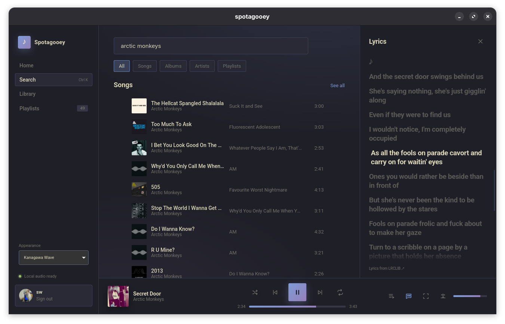
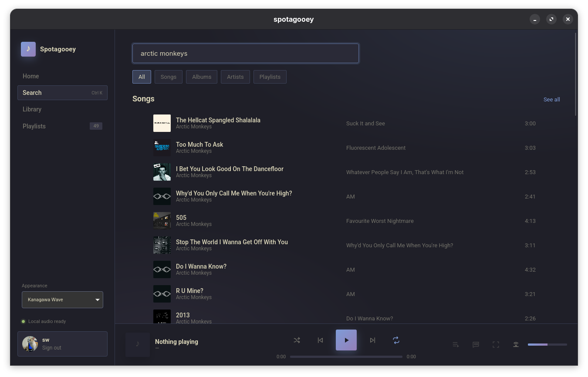
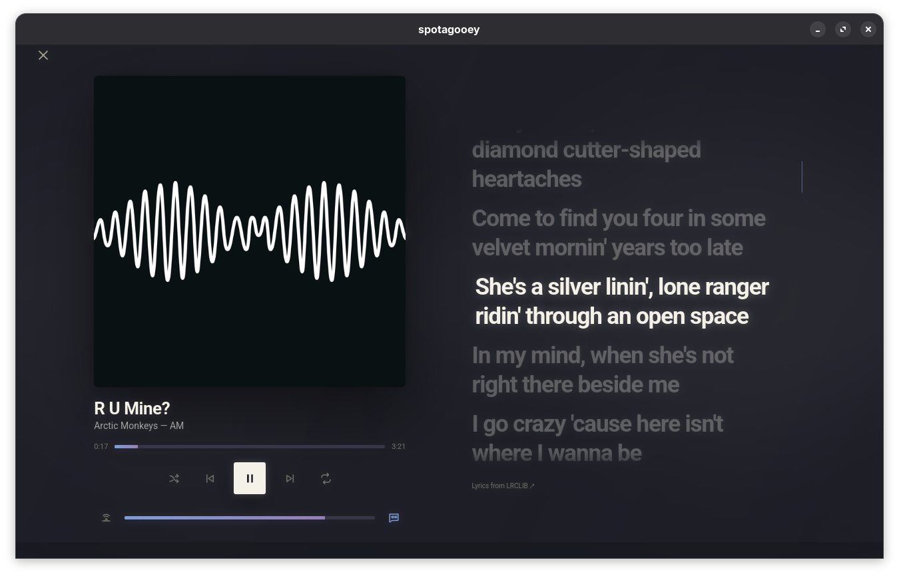
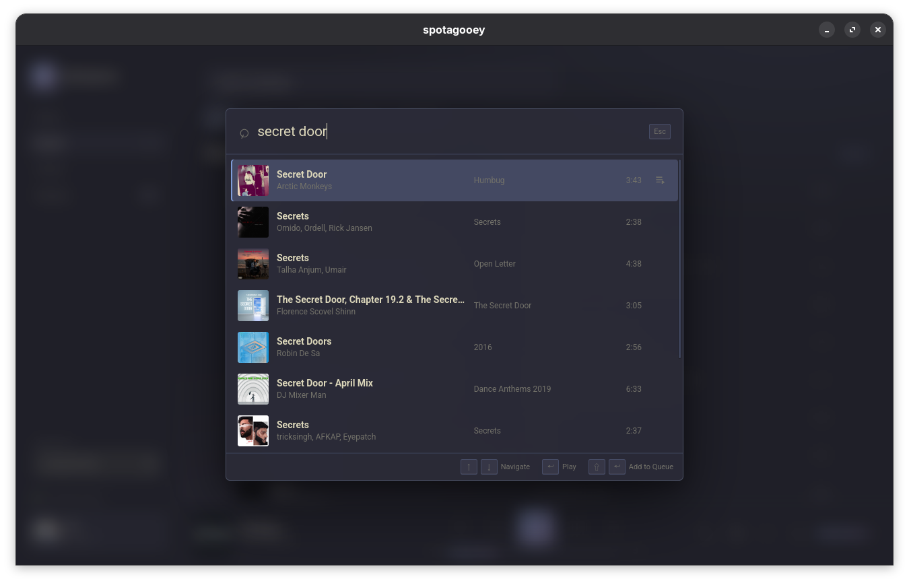

# Spotagooey

A polished desktop Spotify client built with Tauri, Rust, React, and TypeScript.

Spotagooey is a personal, early-stage project focused on a clean music-library experience, fast navigation, native playback, and synced lyrics.



## Features

- Browse and search Spotify songs, albums, artists, and playlists
- Play music locally through the built-in librespot player
- Control other Spotify Connect devices
- View synced lyrics while listening
- Search and play quickly with the `Ctrl+K` command palette
- Manage the play queue without leaving the current screen
- Switch between several visual themes

## Screenshots

### Search



### Full-screen player



### Quick search



## Download

Linux packages are available from the [latest GitHub release](https://github.com/swarnimcodes/spotagooey/releases/latest).

Spotify Premium is required for playback. During setup, Spotagooey guides you through providing a Spotify Developer Client ID.

## Development

```sh
pnpm install
pnpm run tauri dev
```
